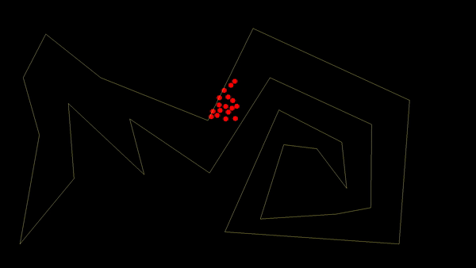
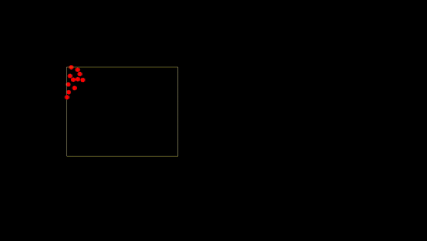
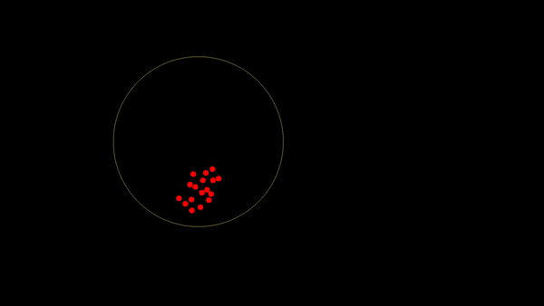

# Poisson Disc Sampling
Poisson Disc Sampling GDScript for Godot. Generates evenly and randomly distributed points for a given region (polygonal or circular) separated by a minimum distance. Points are sorted in the order of their discovery, so it can be used to create interesting animations.

Available on Godot Asset Library: https://godotengine.org/asset-library/asset/559

  

## Usage
```
var points: Array
var poisson_radius: float = 20
var retries: int = 30

# For polygon
var polygon_points = $Polygon2D.polygon
points = PoissonDiscSampling.generate_points_for_polygon(polygon_points, poisson_radius, retries)

# For circle
var circle_position = Vector(400,400)
var circle_radius = 300
points = PoissonDiscSampling.generate_points_for_circle(circle_position, circle_radius, poisson_radius, retries)
```

* `poisson_radius` - minimum distance between points
* `retries` - number of retries to search for a valid sample point around a point. 30 is sufficient, but you can reduce it to increase performance. A very low number will give unevenly spaced distribution.
* `start_point` - starting position is optional. A random point inside region is selected if not specified.


##### Further Reading 
* Core algorithm is based on Sebastian Lague's implementation : [[Unity] Procedural Object Placement (E01: poisson disc sampling)](https://youtu.be/7WcmyxyFO7o)
* [The Coding Train - Coding Challenge #33: Poisson-disc Sampling](https://youtu.be/flQgnCUxHlw)
* [Fast Poisson Disk Sampling in Arbitrary Dimensions - Robert Bridson](https://www.cct.lsu.edu/~fharhad/ganbatte/siggraph2007/CD2/content/sketches/0250.pdf)
